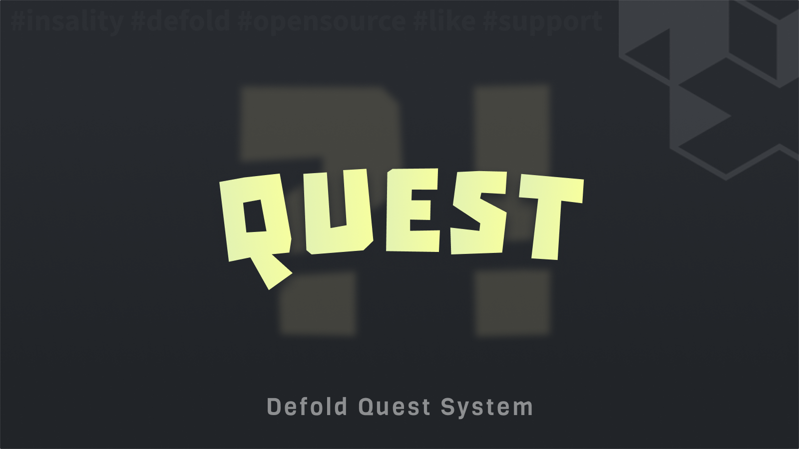

[](https://github.com/Insality/defold-quest/tags)
[](https://github.com/Insality/defold-quest/actions)
[](https://codecov.io/gh/Insality/defold-quest)

[](https://github.com/sponsors/insality) [](https://ko-fi.com/insality) [](https://www.buymeacoffee.com/insality)


# Quest

**Quest** - module is a comprehensive system for managing quests in a game. It allows for the registration, tracking, and completion of quests, with various events and callbacks to handle quest-related activities.

Quest here is a set of tasks that player needs to complete the quest. Just trigger in a required place `quest.event("kill", "enemy")` and all logic will be handled automatically.


## Features

- **Quest Management** - Create, start, and complete quests with ease.
- **Quest Progress** - Track the progress of quests and their tasks.
- **Quest Events** - Listen for quest-related events and adjust it for your needs.


## Setup

### [Dependency](https://www.defold.com/manuals/libraries/)

Open your `game.project` file and add the following line to the dependencies field under the project section:

**[Defold Event](https://github.com/Insality/defold-event)**

```
https://github.com/Insality/defold-event/archive/refs/tags/13.zip
```

**[Defold Quest](https://github.com/Insality/defold-quest/archive/refs/tags/3.zip)**

```
https://github.com/Insality/defold-quest/archive/refs/tags/3.zip
```

After that, select `Project ▸ Fetch Libraries` to update [library dependencies]((https://defold.com/manuals/libraries/#setting-up-library-dependencies)). This happens automatically whenever you open a project so you will only need to do this if the dependencies change without re-opening the project.

### Library Size

> **Note:** The library size is calculated based on the build report per platform

| Platform         | Library Size |
| ---------------- | ------------ |
| HTML5            | **3.91 KB**  |
| Desktop / Mobile | **7.57 KB**  |


## Basic Usage

```lua
local quest = require("quest.quest")

quest.init({
	["quest_01"] = {
		autostart = true,
		autofinish = true,
		category = "quests",
		tasks = { { action = "intro_completed" } },
	},
	["quest_02"] = {
		autostart = true,
		autofinish = true,
		category = "quests",
		required_quests = { "quest_01" },
		tasks = { { action = "collect", object = "coin", required = 10 } },
	},
	["quest_03"] = {
		autostart = true,
		autofinish = true,
		category = "quests",
		required_quests = { "quest_02" },
		tasks = {
			{ action = "kill", object = "enemy", required = 5 },
			{ action = "kill", object = "boss", required = 1 }
		},
	},
})

-- Throw events for active quests
quest.event("kill", "enemy")
quest.event("kill", "enemy", 2)
quest.event("collect", "coin", 3)

-- Subscribe to quest events
quest.on_quest_event:subscribe(function(event_data)
	print("Type", event_data.type)
	print("Quest ID", event_data.quest_id)
	print("Quest Config", event_data.quest_config)
	print("Delta", event_data.delta)
	print("Total", event_data.total)
	print("Task Index", event_data.task_index)
	return true -- Handle quest event
end)

-- Check if any quest is active for specific action and object
local quests = quest.get_current_with_task("kill", "boss")
```

## API Reference

### Quick API Reference

```lua
--- quest.event_data: { type: quest.event_type, quest_id: string, quest_config: quest.config, delta: number, total: number, task_index: number }
--- quest.event_type: "register"|"start"|"progress"|"task_completed"|"completed"

local quest = require("quest.quest")

quest.on_quest_event -- queue(event_data: quest.event_data): boolean
quest.is_can_start -- event(quest_id: string, quest_config: quest.config): boolean
quest.is_can_complete -- event(quest_id: string, quest_config: quest.config): boolean
quest.is_can_event -- event(quest_id: string, quest_config: quest.config): boolean

-- Save and load state, before init
quest.set_state(external_state)
quest.get_state()

-- Initialize quest system
quest.init([quest_config_or_path])
quest.add_quests(quest_config_or_path)

-- Trigger quest event
quest.event(action, [object], [amount])
quest.add_task_progress(quest_id, task_index, amount)

-- Check quest status
quest.is_active([quest_id])
quest.is_completed(quest_id)
quest.is_can_start_quest(quest_id)
quest.is_can_complete_quest(quest_id)
quest.get_progress(quest_id)
quest.get_task_progress(quest_id, task_index)

-- Manage quests
quest.start_quest(quest_id)
quest.complete_quest(quest_id)
quest.force_complete_quest(quest_id)
quest.reset_progress(quest_id)
quest.reset_quest(quest_id)
quest.clear_all_progress()

-- Get quests
quest.get_current([category])
quest.get_completed([category])
quest.get_can_be_started([category])
quest.get_quest_config(quest_id)
quest.get_current_with_task(action, [object])

-- System
quest.set_logger([logger_instance])
quest.reset_state()
quest.get_quests_data()
quest.get_quests_count()
```

### API Reference

Read the [API Reference](api/quest_api.md) file to see the full API documentation for the module.

## Use Cases

Read the [Use Cases](USE_CASES.md) file to see several examples of how to use the this module in your Defold game development projects.

## License

This project is licensed under the MIT License - see the [LICENSE](LICENSE) file for details.

## Issues and Suggestions

For any issues, questions, or suggestions, please [create an issue](https://github.com/Insality/defold-quest/issues).

## 👏 Contributors

<a href="https://github.com/Insality/defold-quest/graphs/contributors">
  
</a>


## Changelog
<details>

### **V1**
- Initial Release

### **V2**
- Tests, refactor, docs, annotations

### **V3**
-- Refactor containers and token API
-- Update docs

</details>

## ❤️ Support project ❤️

Your donation helps me stay engaged in creating valuable projects for **Defold**. If you appreciate what I'm doing, please consider supporting me!

[](https://github.com/sponsors/insality) [](https://ko-fi.com/insality) [](https://www.buymeacoffee.com/insality)
